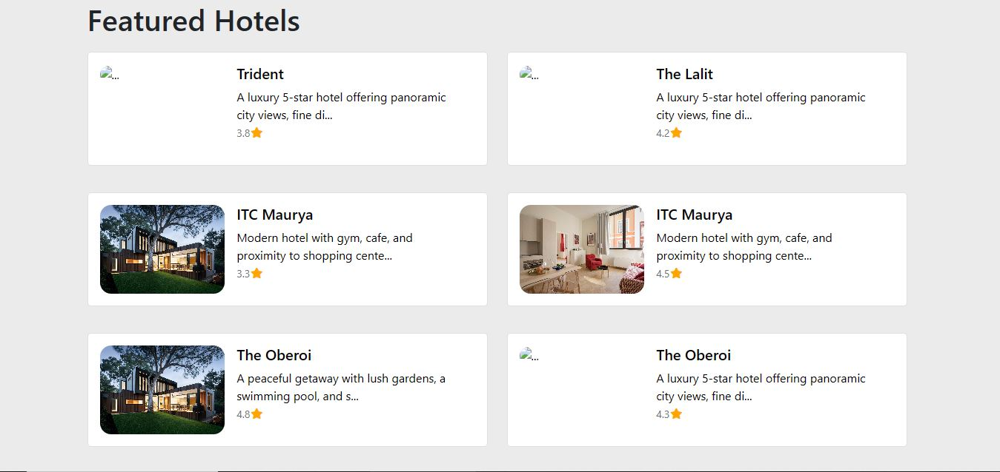
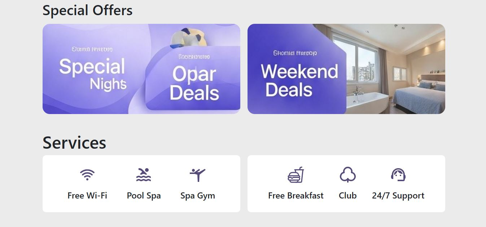
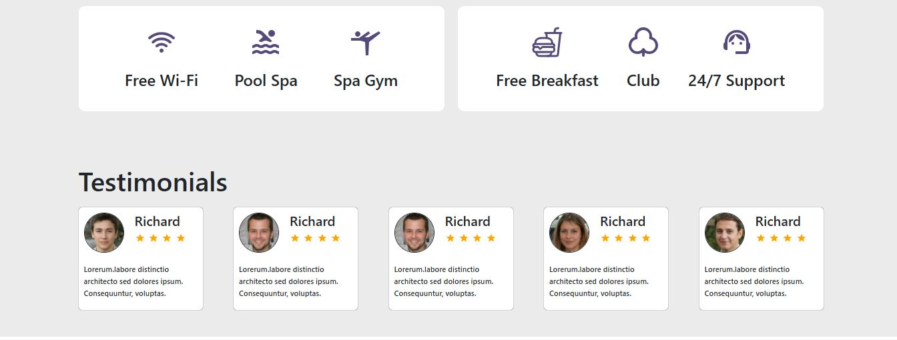
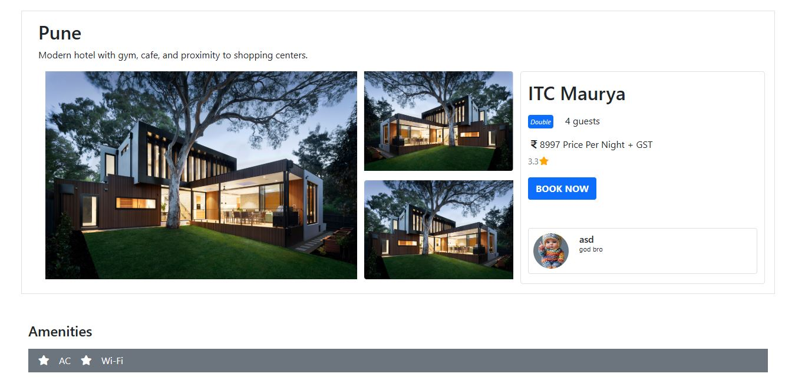
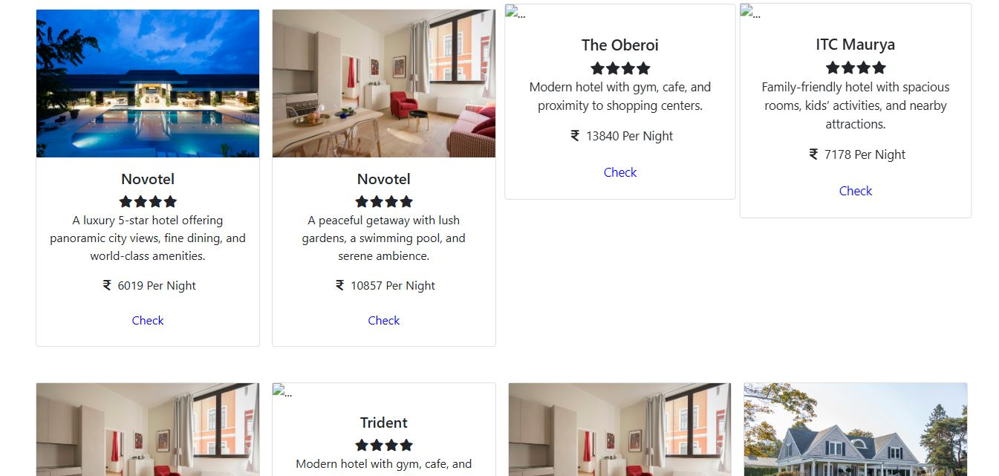
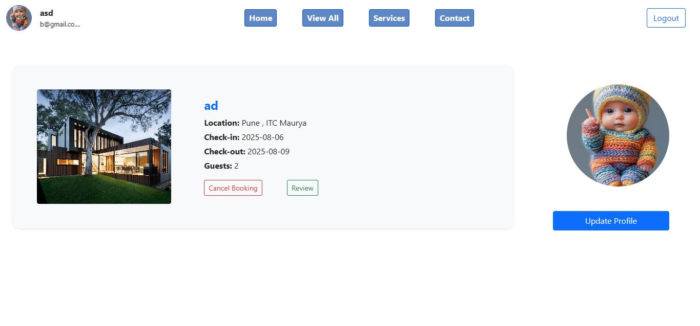
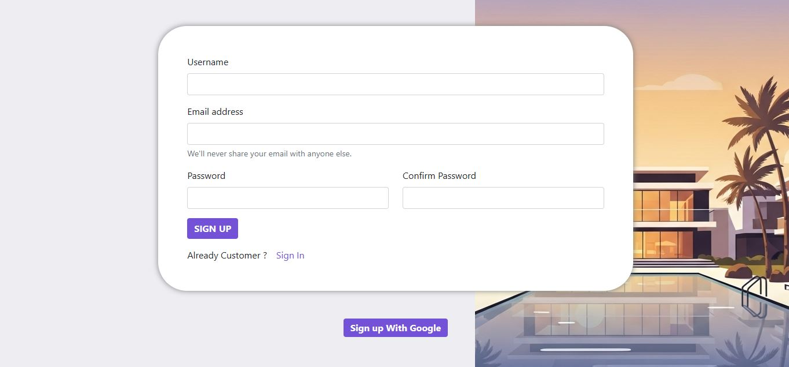
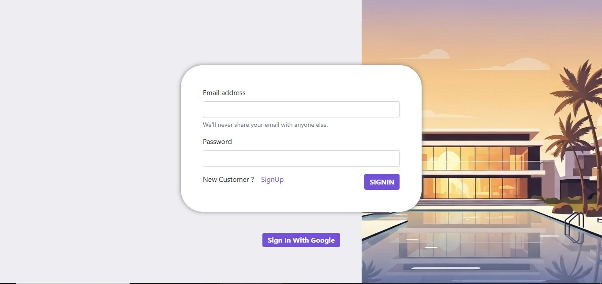

# 🏨 Hotel Booking Website

A fully responsive **Hotel Booking Website** built with modern web technologies.  
This project provides an easy way for users to explore hotels, check offers, read testimonials, and manage their bookings.  

---

## 🚀 Features

### 🌐 Website Pages
- **Hero Section** – Eye-catching banner at the top.  
- **Hotels Section** – Explore available hotels.  
- **Special Offers** – Highlight deals and discounts.  
- **Testimonials** – Customer reviews and feedback.  
- **Footer** – Quick links and contact details.  

### 🏨 Hotel View Page
- View detailed information about a hotel.  
- Explore **more hotel suggestions** below the main hotel detail.  

### 📊 Dashboard Page
- Customers can view their booked hotels.  
- Option to **cancel bookings** directly from the dashboard.  

### 🔑 Authentication
- **Signup Page** – Register as a new customer.  
- **Signin Page** – Login with existing credentials.  

---

## 🛠️ Tech Stack
- **Frontend:** React , HTML , CSS , JavaScript  
- **Backend:** Node.js + Express
- **Database:** MongoDB 
- **Authentication:** JWT

---

## 📸 Screenshots

### 🏠 Home Page





### 🏨 Hotel View Page



### 📊 Dashboard


### 🔑 Signup / Signin



### 🏠 Footer

---

## ⚙️ Setup Instructions
```bash
# Clone the repo
git clone https://github.com/username/hotel-booking.git

# Navigate into project
cd hotel-booking

# Install dependencies
npm install

# Start development server
npm start
